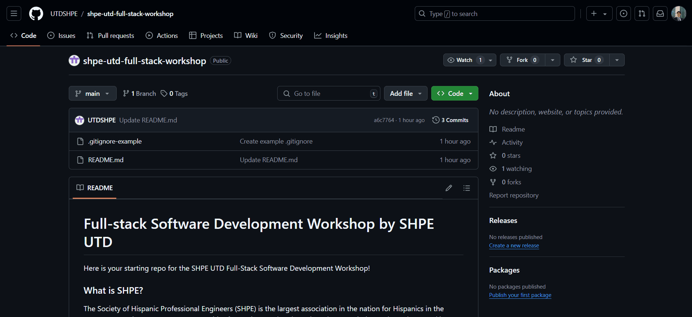
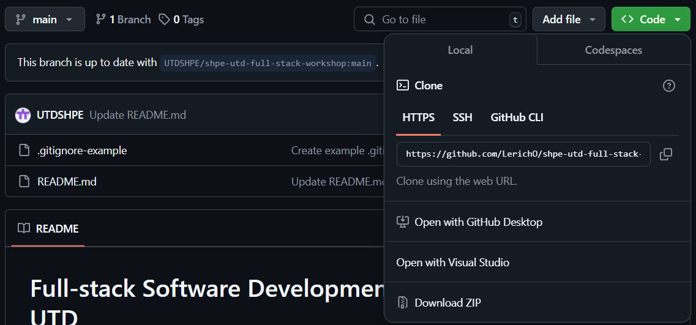
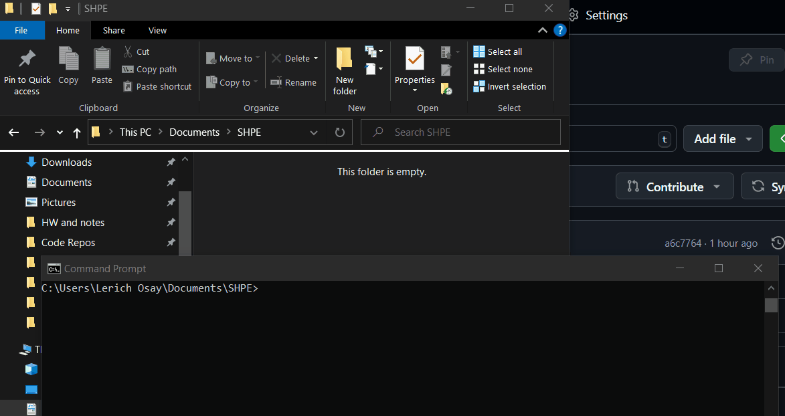
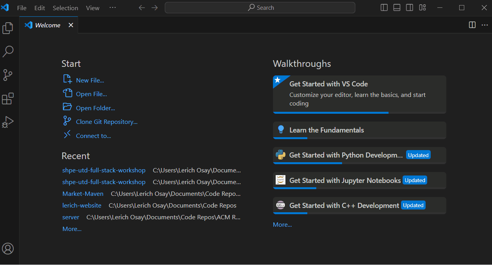
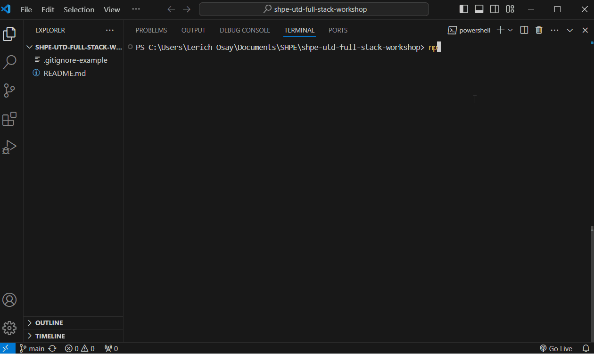
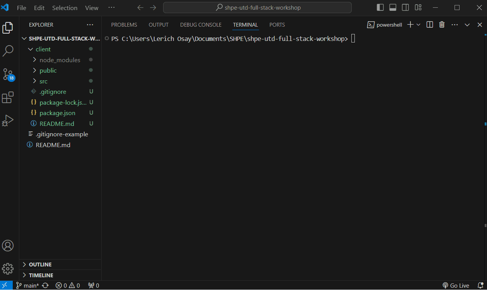

# Full-Stack Software Development Workshop by SHPE UTD

Here is your starting repo for the SHPE UTD Full-Stack Software Development Workshop! 

### What is SHPE?
The Society of Hispanic Professional Engineers (SHPE) is the largest association in the nation for Hispanics in the STEM community. We present opportunities for students to break out into the STEM industry through networking events, corporate tours, socials, and **workshops like this one**!

### Tech Stack - M.E.R.N.

* **MongoDB** - flexible document style NoSQL database
* **Express.js** - lightweight backend framework for Node.js (JavaScript) server applications
* **React** - extremely popular component based frontend UI framework 
* **Node.js** - runtime language for programming and running JavaScript outside of the browser

## Getting Started

Before starting, be sure you have done the following.

* Created a GitHub account
* Installed Git version control
* Installed Node.js
* Installed Visual Studio Code

Begin by first forking the original GitHub repository from UTDSHPE. This will allow us to make a copy of the repository under our own GitHub account.

To clone the repository onto your machine, click the green code button above the files listed in the GitHub repository page. It should show the clone option with HTTPS. Copy the web URL and open the terminal on your machine then change the terminal to the directory where you would like to clone the repository.

Use `cd` to change directory, `ls` to list the contents of your current directory, or if needed, create a new directory with `mkdir`. *If on Windows, you can open the terminal or Git Bash into a given directory through right clicking on a given folder in the File Explorer.*

In the terminal, type the command `git clone` and paste the link copied from the GitHub repository before hitting enter. It should execute similar to how it looks below and show the repository in the same directory. 

### Creating the React client application and the Express.js server application

Open Visual Studio Code, or any other similar text editor or IDE, and open the folder of the repository. Open the terminal of Visual Studio Code and make sure it is at the root directory of your cloned repository.

Create the React client application by running `npx create-react-app client` in the terminal; alternatively, you can instead create the React client application using [Vite](https://vitejs.dev/guide/). A new folder should show up as 'client' or whatever you have named the React app in the root directory of the repository. This folder holds the files for our React client application.

<!-- In the terminal of Visual Studio Code, change directory from the root terminal to the client folder by running `cd client` then run `npm install` to install dependency packages for the React client application. It will add all these files to a new folder called 'node_modules' under the client folder. -->

Create the Express.js server application by creating a new folder in the root directory of the repository called 'server' then create a new file in the folder called 'server.js' (yes it is simple as that)

In the terminal of Visual Studio Code, change the directory from the root folder to the server folder by running `cd server`. Run `npm init` and follow the optional prompts to create a new Node.js project for your Express.js server then run `npm install express` to install the dependency packages for Express.js.

Now it's up to you to code your full-stack project!!

## Additional Resources

* [Dave Gray: MERN Stack Tutorial Playlist](https://www.youtube.com/playlist?list=PL0Zuz27SZ-6P4dQUsoDatjEGpmBpcOW8V)
* [NetNinja: MERN Stack Crash Course Tutorial Playlist](https://www.youtube.com/playlist?list=PL4cUxeGkcC9iJ_KkrkBZWZRHVwnzLIoUE)

